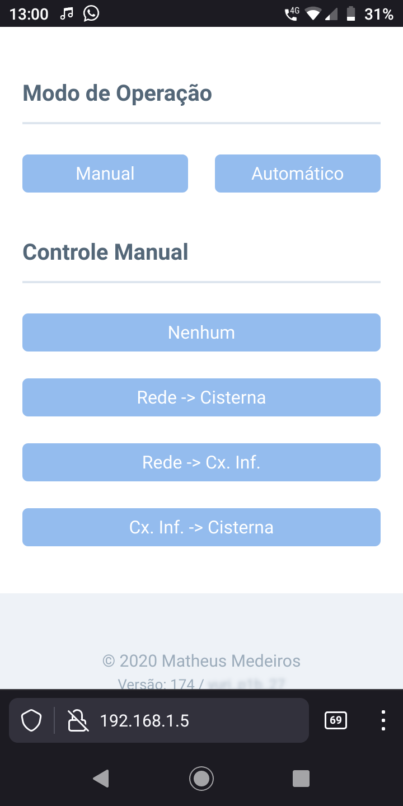

## SACI - Sistema de Automação com Controle via Internet

SACI é um sistema modular de automação, o módulo principal pode ser conectado, via cabo de par-trançado, à até 32 módulos periféricos, com uma distância máxima de 400 metros entre os módulos das extremidades.

A conexão com a rede é feita via Wi-Fi. O usuário pode acessar diretamente o IP do módulo controlador para utilizar a interface web, que permite visualizar dados dos sensores e modificar o estado do sistema, ou mesmo modificar configurações.

Além da interface Web o sistema também pode se conectar a um servidor MQTT (com suporte a SSL), desta maneira o usuário pode inspecionar e controlar todo o sistema remotamente, via internet.

O código dos módulos periféricos está em um [repositório separado](https://github.com/mapame/saci-perifericos-avr).

### Módulo controlador

O módulo controlador possui um microcontrolador ESP8266, um RTC DS3231, um transceptor MAX-485, um led bicolor para indicar o status de conexão e um par de botões para controle. O firmware foi desenvolvido em C, utilizando [FreeRTOS](https://www.freertos.org/)/[esp-open-rtos](https://github.com/SuperHouse/esp-open-rtos) e [esp-open-sdk](https://github.com/pfalcon/esp-open-sdk/).

A interface Web utiliza o toolkit CSS [siimple](https://siimple.xyz/) e se comunica com o controlador via Websockets.

### Comunicação com os módulos periféricos

O módulo controlador sempre inicia a comunicação, enviando um comando que é endereçado a um módulo periférico específico, que responde indicando erro, sucesso ou retornando dados requisitados. O protocolo é baseado em texto e a taxa de transmissão é 115200 bauds.

Formato dos comandos:  

|Campo   |Descrição                       |
|--------|--------------------------------|
|SOH     |Caractere 0x01 (Start of Header)|
|Endereço|Endereço em base hexadecimal com caracteres maiúsculos|
|:       |Caractere dois-pontos           |
|Comando|Um caractere maiúsculo para especificar o comando|
|STX     |Caractere 0x02 (Start of Text)  |
|Corpo   |Corpo do comando                |
|ETX     |Caractere 0x03 (End of Text)    |

A resposta utiliza o mesmo formato, mas endereçado ao módulo controlador, que possui o endereço FF.

### Imagens
#### Placa do módulo controlador

#### Painel de controle da interface web

#### Configuração via interface web

#### Controle remoto via MQTT

#### Controle remoto via Adafruit IO
